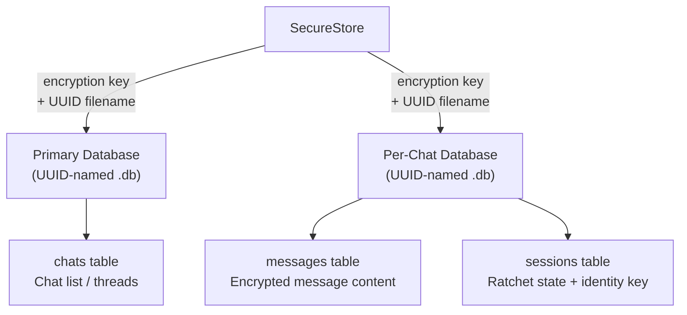
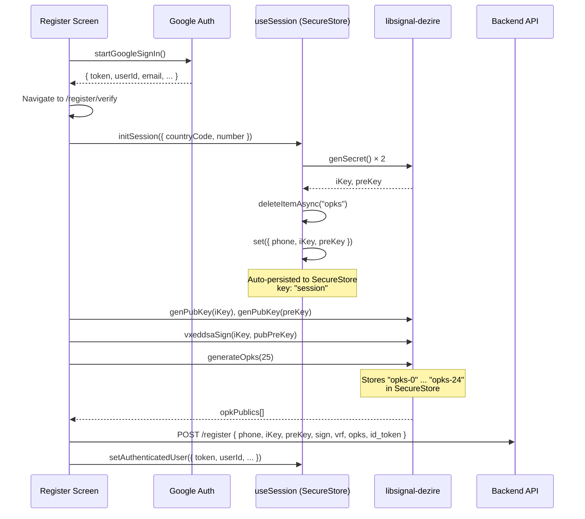
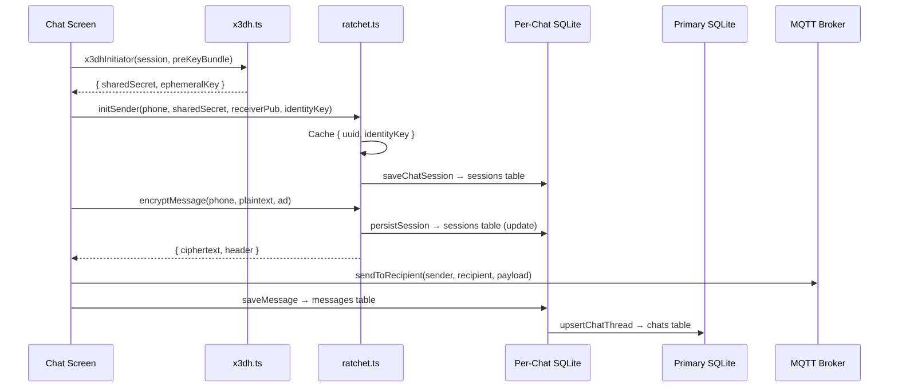
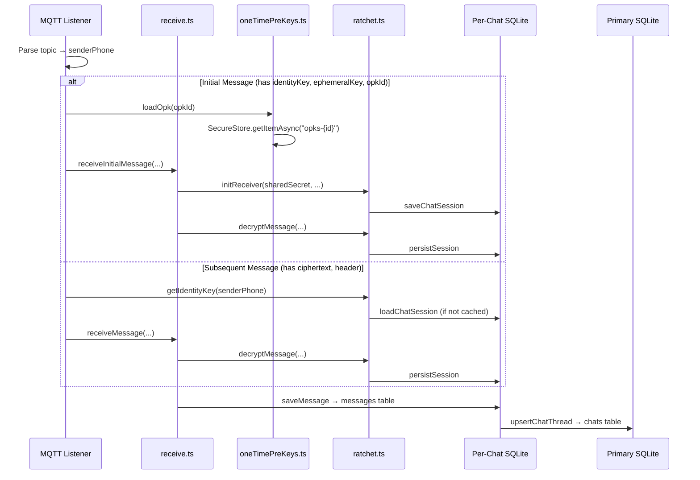

# KhamoshChat — Data Storage Analysis

## Overview

KhamoshChat uses a **three-tier storage architecture**:

| Tier | Technology | Purpose | Encrypted? |
|------|-----------|---------|------------|
| **Secure Storage** | `expo-secure-store` (Keychain/Keystore) | Cryptographic secrets, session state, DB credentials | ✅ OS-level |
| **SQLite** | `expo-sqlite` + SQLCipher PRAGMA | Messages, chat sessions, chat list | ✅ App-level |
| **In-Memory** | JS objects / Zustand stores | Ratchet session cache, MQTT connection state | ❌ Volatile |

---

## 1. Expo SecureStore — What's Stored

All SecureStore entries use `keychainAccessible: AFTER_FIRST_UNLOCK`, which allows background access after the first device unlock.

### 1.1 Session Store (`useSession.ts`)

**Key:** `"session"` (Zustand persist key)

Stored as a single JSON blob containing:

| Field | Type | Sensitivity | Description |
|-------|------|------------|-------------|
| `phone` | `{ countryCode, number }` | PII | User's phone identity |
| `iKey` | `Uint8Array` (serialized as JSON object) | 🔴 Critical | **Identity private key** — root of all crypto |
| `preKey` | `Uint8Array` (serialized as JSON object) | 🔴 Critical | **Signed pre-key private** — used for X3DH |
| `isRegistered` | `boolean` | Low | Registration status |
| `isAuthenticated` | `boolean` | Low | Auth status (derived on load) |
| `authProvider` | `"google" \| null` | Low | OAuth provider |
| `authToken` | `string \| null` | 🟡 Medium | Google ID token |
| `userId` | `string \| null` | PII | Google user ID |
| `email` | `string \| null` | PII | User email |
| `displayName` | `string \| null` | PII | Display name |
| `avatarUrl` | `string \| null` | Low | Avatar URL |

**Retrieval:** Zustand's `persist` middleware auto-hydrates on app start. The `merge` function handles `Uint8Array` deserialization and derives `isAuthenticated` from `authToken + userId`.

```typescript
// Hydration merge (useSession.ts L139-161)
merge: (persistedState, currentState) => {
    const merged = { ...currentState, ...(persistedState as object) };
    // Uint8Array reconstruction from JSON-serialized object
    if (merged.iKey && !(merged.iKey instanceof Uint8Array)) {
        merged.iKey = new Uint8Array(Object.values(merged.iKey));
    }
    // Derived fields
    merged.isAuthenticated = Boolean(merged.authToken && merged.userId);
    ...
}
```

### 1.2 One-Time Pre-Keys (`oneTimePreKeys.ts`)

**Keys:** `"opks-0"`, `"opks-1"`, ... `"opks-24"` (25 keys by default)

| Field | Type | Sensitivity | Description |
|-------|------|------------|-------------|
| OPK private key | Base64 string | 🔴 Critical | One-time pre-key private (one per X3DH handshake) |

**Storage flow:**
```
generateOpks(count=25) → for each i:
    genKeyPair() → store secret as Base64 at "opks-{i}"
                 → return public as Base64 to server
```

**Retrieval:** `loadOpk(id)` → `getItemAsync("opks-{id}")` → `fromBase64()` → `Uint8Array`

### 1.3 Database Credentials (`keys.ts`)

**Keys:** `"chat_creds___primary__"`, `"chat_creds_{sanitized_phone}"`

| Field | Type | Sensitivity | Description |
|-------|------|------------|-------------|
| `key` | 64-char hex string | 🔴 Critical | 256-bit SQLCipher encryption key |
| `dbId` | UUID string | Low | Randomized DB filename |

**Retrieval:** `getOrCreateDatabaseCredentials(chatId)` — lazily creates if missing:
```
sanitize chatId → lookup "chat_creds_{safe}" in SecureStore
  → found? parse JSON, return { key, dbId }
  → not found? generate 32 random bytes → hex key, uuid → store & return
```

---

## 2. SQLite — What's Stored

### Architecture



Each database is:
1. **Named with a UUID** — no user data in filenames
2. **Encrypted with SQLCipher** — `PRAGMA key = '{hex_key}'`
3. **WAL mode** — for concurrent read/write
4. **Foreign keys** — enabled via PRAGMA

### 2.1 Primary Database

**Schema** (version 1):

```sql
CREATE TABLE chats (
    phone         TEXT PRIMARY KEY NOT NULL,  -- Contact phone number
    name          TEXT,                       -- Contact name (nullable)
    last_message  TEXT,                       -- Preview text
    last_message_at INTEGER NOT NULL,         -- Timestamp (ms)
    unread_count  INTEGER DEFAULT 0,          -- Unread badge count
    updated_at    INTEGER NOT NULL            -- Sort key
);

CREATE INDEX idx_chats_updated ON chats(updated_at DESC);
```

**CRUD operations** ([chatList.ts](file:///Users/destiny/Important/code/khamoshchat-mobile/src/utils/storage/chatList.ts)):

| Operation | Function | SQL |
|-----------|----------|-----|
| Upsert | `upsertChatThread(phone, lastMessage)` | `INSERT ... ON CONFLICT(phone) DO UPDATE` |
| List | `getChatThreads()` | `SELECT * FROM chats ORDER BY updated_at DESC` |
| Delete | `deleteChatThread(phone)` | `DELETE FROM chats WHERE phone = ?` |

**Pub/Sub:** A manual listener pattern notifies the UI on writes:
```
chatListListeners[] → subscribeToChatList(callback) → returns unsubscribe fn
upsertChatThread / deleteChatThread → notifyChatListListeners()
```

### 2.2 Per-Chat Database

**Schema** (version 2):

```sql
-- Migration v1
CREATE TABLE messages (
    id         TEXT PRIMARY KEY NOT NULL,  -- UUID
    content    TEXT,                       -- Plaintext message body
    sender_id  TEXT NOT NULL,              -- "me" or sender phone
    created_at INTEGER NOT NULL,           -- Timestamp (ms)
    status     TEXT DEFAULT 'sent'         -- 'sent' | 'delivered' | 'read'
);
CREATE INDEX idx_messages_created_at ON messages(created_at);

-- Migration v2
CREATE TABLE sessions (
    key        TEXT PRIMARY KEY NOT NULL,  -- Always "chat_session"
    value      TEXT NOT NULL,              -- JSON: { identityKey, ratchetState? }
    updated_at INTEGER NOT NULL
);
```

**Messages CRUD** ([messages.ts](file:///Users/destiny/Important/code/khamoshchat-mobile/src/utils/storage/messages.ts)):

| Operation | Function | Details |
|-----------|----------|---------|
| Read | `getMessages(chatId)` | Opens DB if needed, reads all, closes if it wasn't open before |
| Write | `saveMessage(chatId, { content, sender_id })` | Generates UUID, inserts, also calls `upsertChatThread` |

**Session CRUD** ([chats.ts](file:///Users/destiny/Important/code/khamoshchat-mobile/src/utils/storage/chats.ts)):

| Operation | Function | Details |
|-----------|----------|---------|
| Save | `saveChatSession(phone, session)` | `INSERT OR REPLACE INTO sessions` |
| Load | `loadChatSession(phone)` | `SELECT value FROM sessions WHERE key = 'chat_session'` |
| Delete | `deleteChatSession(phone)` | `DELETE FROM sessions WHERE key = 'chat_session'` |

The session value is JSON:
```typescript
type ChatSession = {
    identityKey: string;      // Base64 identity key of the contact
    ratchetState?: string;    // Serialized ratchet state (opaque blob from Rust FFI)
};
```

---

## 3. In-Memory Storage

### 3.1 Ratchet Session Cache ([ratchet.ts](file:///Users/destiny/Important/code/khamoshchat-mobile/src/utils/crypto/ratchet.ts))

```typescript
const sessionCache: Record<string, { uuid: string; identityKey: string }> = {};
```

- **`uuid`** — Handle to the Rust-side ratchet state (lives in Rust heap, accessed via native module)
- **`identityKey`** — Cached copy of the contact's identity key

**Cache lifecycle:**
```
ensureSessionLoaded(phone)
  → check cache hit
  → miss: loadChatSession(phone) from SQLite
  → ratchetDeserialize(storedState) → get Rust handle UUID
  → cache it

persistSession(phone)
  → ratchetSerialize(uuid) → get serialized blob
  → saveChatSession(phone, { identityKey, ratchetState })
```

> [!IMPORTANT]
> Every encrypt/decrypt operation calls `persistSession` to ensure the ratchet state survives app restarts. This is correct but creates **heavy I/O on every message**.

### 3.2 Database Connection Pool ([database.ts](file:///Users/destiny/Important/code/khamoshchat-mobile/src/utils/storage/database.ts))

```typescript
const activeDatabases = new Map<string, SQLite.SQLiteDatabase>();
let primaryDb: SQLite.SQLiteDatabase | null = null;
```

### 3.3 MQTT Store ([useMqttStore.ts](file:///Users/destiny/Important/code/khamoshchat-mobile/src/store/useMqttStore.ts))

Zustand store (**not persisted**):
- `client` — MqttClient instance
- `isConnected` — connection status

---

## 4. Complete Data Flow Diagrams

### Registration Flow



### Message Send Flow (Initial)



### Message Receive Flow



---

## 5. Issues & Suggestions

### 🔴 Critical Security Issues

#### 5.1 SQL Injection via PRAGMA key

In [database.ts:34](file:///Users/destiny/Important/code/khamoshchat-mobile/src/utils/storage/database.ts#L34) and [L77](file:///Users/destiny/Important/code/khamoshchat-mobile/src/utils/storage/database.ts#L77):

```typescript
await db.execAsync(`PRAGMA key = '${key}';`);  // ⚠️ String interpolation
```

While `key` is currently a hex string generated internally, this is a **dangerous pattern**. If any code path ever corrupts or manipulates the key store, this becomes a SQL injection vector.

**Fix:** Use the `"x'...'"` hex literal format which is the standard SQLCipher approach, or pass through a parameterized interface if `expo-sqlite` supports it for PRAGMAs.

```diff
- await db.execAsync(`PRAGMA key = '${key}';`);
+ await db.execAsync(`PRAGMA key = "x'${key}'";`);
```

#### 5.2 Hardcoded MQTT Credentials

In [useMqtt.ts:94](file:///Users/destiny/Important/code/khamoshchat-mobile/src/hooks/useMqtt.ts#L94):

```typescript
await MqttClient.connect(url, "dezire", "test1234", { ... });
```

Credentials `"dezire"` / `"test1234"` are hardcoded. These should at minimum come from the SecureStore session or a per-user auth token.

#### 5.3 OPKs Are Never Cleaned Up After Use

When a one-time pre-key is consumed in `receiveInitialMessage`, the OPK private key (`"opks-{id}"`) is **never deleted** from SecureStore. This means:
- Used OPK secrets linger on-device indefinitely
- A compromised device leaks all historical OPK secrets

**Fix:** Add `deleteItemAsync(`opks-${id}`)` after successful X3DH responder completion in `receiveInitialMessage`.

### 🟡 Reliability Concerns

#### 5.4 No Offline Message Queue

If MQTT is disconnected when the user sends a message, the message is silently dropped:

```typescript
// send.ts L129-133
if (!isConnected) {
    console.log('MQTT not connected');
    return;  // Message lost forever
}
```

**Suggestion:** Implement a persistent outbox queue in SQLite. Save unsent messages with `status: 'pending'` and flush when MQTT reconnects.

#### 5.5 Ratchet State Persisted on Every Message

Every `encryptMessage()` and `decryptMessage()` call triggers `persistSession()` → full serialize + SQLite write. For rapid message exchanges, this is **heavy I/O**.

**Suggestion:** Debounce persistence (e.g., persist every N messages or after a timeout), or batch writes. The trade-off is losing at most N ratchet steps on crash, which would require re-establishing the session.

#### 5.6 `getMessages()` Opens & Closes DB When Not Already Open

In [messages.ts:49-64](file:///Users/destiny/Important/code/khamoshchat-mobile/src/utils/storage/messages.ts#L49-L64):

```typescript
const wasOpen = isDatabaseOpen(chatId);
const db = await openChatDatabase(chatId);
try { ... } finally {
    if (!wasOpen) await closeChatDatabase(chatId);
}
```

This is fine for one-off reads but creates overhead when called in quick succession (e.g., the message subscription callback re-fetches all messages on every update).

**Suggestion:** Keep the connection open for the duration the chat screen is mounted (which `[number].tsx` already does correctly). Remove the open/close logic from `getMessages` and require callers to manage the lifecycle.

#### 5.7 Chat List Pub/Sub Uses Array-Based Listeners

The listener pattern in [chatList.ts](file:///Users/destiny/Important/code/khamoshchat-mobile/src/utils/storage/chatList.ts#L24-L35) accumulates listeners in an array. If a component subscribes but the cleanup function doesn't fire (e.g., hot reload), listeners leak.

**Suggestion:** Use a `Set` instead, and consider adding a `WeakRef`-based mechanism or React's `useSyncExternalStore` pattern for safer integration.

### 🟢 Architectural Suggestions

#### 5.8 `Uint8Array` Serialization in SecureStore

The session store serializes `Uint8Array` via JSON, which produces `{"0":1,"1":255,...}` — an object with numeric keys. The `merge` function reconstructs it with `Object.values()`. This is fragile and wasteful.

**Suggestion:** Encode `iKey` and `preKey` as Base64 strings before storing, and decode on hydration. This saves ~60% space and eliminates the `Object.values()` hack.

```typescript
// In persist storage adapter:
setItem: (key, value) => {
    // value is already JSON-stringified by Zustand
    // Consider a custom serializer that Base64-encodes Uint8Arrays
}
```

#### 5.9 Missing Database Backup / Export Strategy

All message history lives in per-chat encrypted SQLite files. If the user loses their device:
- The encryption keys (in SecureStore/Keychain) are gone
- The databases are unrecoverable

This is by-design for maximum security, but users should be informed. Consider:
- A manual encrypted backup option
- Key escrow with user-controlled passphrase

#### 5.10 No `unread_count` Management

The `chats` table has `unread_count` but it's **never incremented**. `upsertChatThread` always sets it to 0. Incoming messages don't update it.

**Fix:** Increment `unread_count` in `upsertChatThread` when the message is from someone else, and reset to 0 when the user opens the chat.

```sql
-- On receive:
ON CONFLICT(phone) DO UPDATE SET
    unread_count = chats.unread_count + 1,
    ...

-- On chat open:
UPDATE chats SET unread_count = 0 WHERE phone = ?
```

#### 5.11 Phone Number as Primary Identifier

The `chats` table uses `phone TEXT PRIMARY KEY`. If a user changes their phone number, all their chat history becomes orphaned. Consider using a stable user ID as the primary key.

#### 5.12 Missing Structured Logging

Error handling across the storage layer uses `console.error` / `console.warn` with string messages. For a crypto-sensitive application, consider:
- A structured logger with log levels
- Redaction of sensitive values (keys, phone numbers) in logs
- Crash reporting integration (Sentry, etc.)

---

## 6. Data Sensitivity Matrix

| Data | Storage | Encryption | Backup Risk | Leak Impact |
|------|---------|-----------|-------------|-------------|
| Identity Key (private) | SecureStore | OS Keychain | Lost on device wipe | **Total compromise** — all sessions broken |
| Pre-Key (private) | SecureStore | OS Keychain | Lost on device wipe | Future sessions compromised |
| OPK privates (×25) | SecureStore | OS Keychain | Lost on device wipe | Individual sessions compromised |
| Auth Token (Google) | SecureStore | OS Keychain | Lost on device wipe | Account access |
| DB Encryption Keys | SecureStore | OS Keychain | Lost on device wipe | All messages readable |
| Ratchet State | SQLite (encrypted) | SQLCipher | Lost on device wipe | Session continuity lost |
| Message Content | SQLite (encrypted) | SQLCipher | Lost on device wipe | Message content exposure |
| Chat List | SQLite (encrypted) | SQLCipher | Lost on device wipe | Contact list exposure |
| Phone / Email / Name | SecureStore | OS Keychain | Lost on device wipe | PII exposure |
| MQTT state | Memory only | None | N/A (volatile) | Connection hijack |

---

## 7. Summary of Recommended Priority Actions

| Priority | Issue | Effort |
|----------|-------|--------|
| 🔴 P0 | Delete consumed OPKs from SecureStore after X3DH (#5.3) | Small |
| 🔴 P0 | Fix PRAGMA key SQL interpolation (#5.1) | Small |
| 🔴 P0 | Remove hardcoded MQTT credentials (#5.2) | Medium |
| 🟡 P1 | Implement `unread_count` management (#5.10) | Small |
| 🟡 P1 | Add offline message queue (#5.4) | Medium |
| 🟡 P1 | Use Base64 for Uint8Array serialization (#5.8) | Small |
| 🟢 P2 | Debounce ratchet persistence (#5.5) | Medium |
| 🟢 P2 | Stabilize chat identity beyond phone (#5.11) | Large |
| 🟢 P2 | Add structured logging (#5.12) | Medium |
| 🟢 P2 | Evaluate backup strategy (#5.9) | Large |
