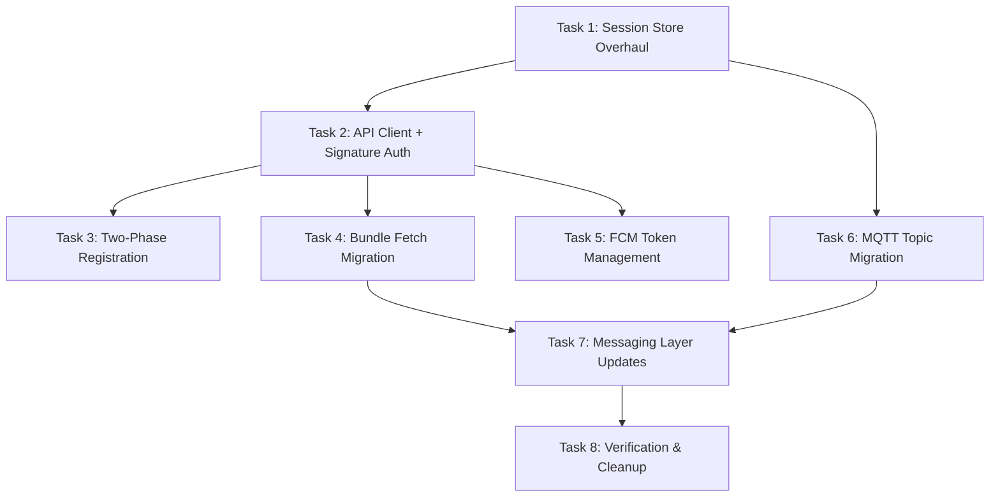

# Implementation Plan: KhamoshChat Mobile ↔ Backend API Sync

> **Context**: The backend (`khamoshchat-api`) was redesigned on the `redesign` branch. The mobile app's networking layer is still wired to the pre-redesign contract. This plan enumerates every breaking change and prescribes exact fixes.

---

## Changelog Summary: What Changed in the API

| Area | Old (pre-redesign) | New (redesign branch) | Impact |
|---|---|---|---|
| **Registration** | Single `POST /register/google_oauth/id_token` with all keys + phone | **Phase 1**: `POST /register/google/id_token` (OAuth only) → **Phase 2**: `POST /register/device` (keys + phone) | 🔴 Breaking |
| **Auth Headers** | Custom `phone`/`signature`/`vrf` in body | `X-User-Id`, `X-Timestamp`, `X-Signature` headers; payload = `userId + timestamp` | 🔴 Breaking |
| **Bundle Fetch** | `POST /bundle/{number}` with phone+signature in body | `POST /bundle/{identifier}` with auth headers (identifier = phone, email, or userId) | 🔴 Breaking |
| **Identifiers** | Phone-number-centric (`+91XXXXXXXXXX`) | UUID `userId` + `deviceId` | 🟡 Major |
| **FCM Token Update** | Unauthenticated `POST /register/device/fcm` with phone+signature | Authenticated `POST /register/device/fcm` with `X-User-Id`/`X-Signature` headers | 🔴 Breaking |
| **Env Vars** | `EXPO_PUBLIC_IDENTITY_URL` (hardcoded in send.ts) | `EXPO_PUBLIC_API_URL` (single base URL, port 3000) | 🟡 Minor |
| **MQTT Topics** | `/khamoshchat/{recipient_phone}/{sender_phone}` | `/khamoshchat/{recipient_id}/{recipient_device_id}/{sender_id}/{sender_device_id}` | 🔴 Breaking |

---

## Task Dependency Graph



---

## Task 1: Session Store Overhaul

**File**: [useSession.ts](file:///Users/destiny/Important/code/khamoshchat-mobile/src/store/useSession.ts)

**Why**: The backend now assigns a UUID `userId` during Phase 1 (OAuth) and expects a `deviceId` for device registration. The session store must track both. The `isAuthenticated` / `isRegistered` split needs to map to Phase 1 vs Phase 2 completion.

### Changes

1. **Add `deviceId: string | null`** to `Session` type and store defaults.
   - Generate via `Crypto.randomUUID()` on first launch if null.

2. **Refine state semantics**:
   - `isAuthenticated = true` → Phase 1 complete (have `userId` + `googleOauthToken`)
   - `isRegistered = true` → Phase 2 complete (device + keys uploaded)
   - Currently `setAuthenticatedUser` sets *both* `isAuthenticated` and `isRegistered` to `true`. It should only set `isAuthenticated = true` after Phase 1.

3. **Update `setAuthenticatedUser`**:
   ```diff
   - isRegistered: true,
   + isRegistered: false,
   ```
   Add a new action `markDeviceRegistered` that sets `isRegistered = true` after Phase 2.

4. **Update `clearSession` / `clearAuthenticatedUser`** to also reset `deviceId`.

5. **Update merge function** to handle `deviceId` rehydration:
   ```typescript
   merged.deviceId = merged.deviceId ?? null;
   ```

### Acceptance Criteria
- [ ] `deviceId` is generated once and persisted across restarts
- [ ] After Google sign-in only: `isAuthenticated=true`, `isRegistered=false`
- [ ] After device registration: `isAuthenticated=true`, `isRegistered=true`

---

## Task 2: Centralized API Client + Stateless Signature Auth

**New file**: `src/utils/transport/api.ts`

**Why**: The backend now requires stateless signature auth on protected endpoints. The signing contract is: sign `userId + timestamp` with the user's `signedPreKey` (SPK) private key. Headers: `X-User-Id`, `X-Timestamp`, `X-Signature`.

### Changes

1. **Create `src/utils/transport/api.ts`** with:

```typescript
import LibsignalDezireModule from "@/modules/libsignal-dezire/src/LibsignalDezireModule";
import useSession from "@/src/store/useSession";
import { toBase64, toBytes } from "@/src/utils/helpers/encoding";

const API_BASE_URL = process.env.EXPO_PUBLIC_API_URL || "https://kchat.dkmondal.in";

type RequestOptions = {
  method?: string;
  body?: object;
  authenticated?: boolean;
};

/**
 * Makes an API request to the backend with optional stateless signature auth.
 */
export async function apiRequest<T = unknown>(
  path: string,
  options: RequestOptions = {}
): Promise<T> {
  const { method = "GET", body, authenticated = false } = options;

  const headers: Record<string, string> = {
    "Content-Type": "application/json",
  };

  if (authenticated) {
    const session = useSession.getState();
    if (!session.userId || !session.preKey || session.preKey.byteLength === 0) {
      throw new Error("Cannot authenticate: missing userId or preKey");
    }

    const timestamp = Date.now().toString();
    const payload = `${session.userId}${timestamp}`;
    const { signature } = await LibsignalDezireModule.vxeddsaSign(
      session.preKey,
      toBytes(payload)
    );

    headers["X-User-Id"] = session.userId;
    headers["X-Timestamp"] = timestamp;
    headers["X-Signature"] = toBase64(signature);
  }

  const res = await fetch(`${API_BASE_URL}${path}`, {
    method,
    headers,
    body: body ? JSON.stringify(body) : undefined,
  });

  if (!res.ok) {
    const text = await res.text();
    throw new ApiError(res.status, text, path);
  }

  return res.json() as Promise<T>;
}

export class ApiError extends Error {
  status: number;
  path: string;
  constructor(status: number, message: string, path: string) {
    super(`API ${status} on ${path}: ${message}`);
    this.status = status;
    this.path = path;
  }
}
```

> [!IMPORTANT]
> The API's signature verification uses the `signedPreKey` (SPK) public key stored in DynamoDB. The mobile client must sign with the *private* SPK (`session.preKey`). This is consistent with the existing code but critical to document.

> [!NOTE]
> The backend has **two ports** (3000 public, 3001 private), but in production they are behind a single reverse proxy (`kchat.dkmondal.in`). The private endpoint `/offline_message` is only called by the MQTT broker webhook, not by the mobile client. So a single `API_BASE_URL` is sufficient.

### Acceptance Criteria
- [ ] Authenticated requests include correct `X-User-Id`, `X-Timestamp`, `X-Signature` headers
- [ ] Signature payload = `userId + timestamp` (string concatenation, not JSON)
- [ ] Unauthenticated requests (registration Phase 1/2) work without headers

---

## Task 3: Two-Phase Registration Flow

**Files**:
- [google.ts](file:///Users/destiny/Important/code/khamoshchat-mobile/src/utils/auth/google.ts)
- [register/index.tsx](file:///Users/destiny/Important/code/khamoshchat-mobile/src/app/register/index.tsx)
- [register/verify.tsx](file:///Users/destiny/Important/code/khamoshchat-mobile/src/app/register/verify.tsx)

**Why**: Registration is now a two-phase handshake. Phase 1 verifies the Google ID token and returns a `userId`. Phase 2 uploads crypto keys + phone + device info.

### 3.1 Update `google.ts` — Split into Two Functions

**Replace `registerWithGoogleBackend`** with two functions:

```typescript
// Phase 1: OAuth verification only
export async function verifyGoogleIdToken(idToken: string): Promise<{
  userId: string;
  email: string;
  name: string | null;
  picture: string | null;
}> {
  return apiRequest("/register/google/id_token", {
    method: "POST",
    body: { id_token: idToken },
  });
}

// Phase 2: Device & key registration
export async function registerDevice(
  userId: string,
  phoneDetails: { countryCode: string; number: number },
  deviceId: string,
  fcmToken?: string | null,
): Promise<void> {
  const session = useSession.getState();
  const { iKey, preKey } = await session.initSession(phoneDetails);

  const pubIKey = await LibsignalDezireModule.genPubKey(iKey);
  const pubPreKey = await LibsignalDezireModule.genPubKey(preKey);
  const { signature, vrf } = await LibsignalDezireModule.vxeddsaSign(iKey, pubPreKey);
  const signedDeviceKey = await LibsignalDezireModule.vxeddsaSign(preKey, toBytes(deviceId));
  const b64Opks = await generateOpks();

  await apiRequest("/register/device", {
    method: "POST",
    body: {
      user_id: userId,
      phone: `${phoneDetails.countryCode}${phoneDetails.number}`,
      iKey: toBase64(pubIKey),
      signedPreKey: toBase64(pubPreKey),
      sign: toBase64(signature),
      vrf: toBase64(vrf),
      opks: b64Opks,
      device_id: deviceId,
      signedDeviceKey: toBase64(signedDeviceKey.signature),
      fcmToken: fcmToken ?? undefined,
    },
  });
}
```

### 3.2 Update `register/index.tsx`

No structural changes needed — it already navigates to `/register/verify` with the Google token and profile info. But the `userId` should come from the **backend** (Phase 1 response), not from Google's user ID.

```diff
  const handleGoogleSignIn = async () => {
    const user = await startGoogleSignIn();
+   // Phase 1: verify with backend, get server-assigned userId
+   const phase1 = await verifyGoogleIdToken(user.token);
    router.push({
      pathname: "/register/verify",
      params: {
        token: user.token,
-       userId: user.userId,
+       userId: phase1.userId,
        email: user.email || "",
        displayName: user.displayName || "",
        avatarUrl: user.avatarUrl || "",
      },
    });
  };
```

### 3.3 Update `register/verify.tsx`

This screen handles Phase 2. After the user enters their phone number:

```diff
  const handleCompleteRegistration = async () => {
-   await registerWithGoogleBackend(token, { countryCode, number: Number(phoneNumber) });
-   setAuthenticatedUser({ token, userId, email, displayName, avatarUrl });
+   // Generate or retrieve deviceId
+   const session = useSession.getState();
+   const deviceId = session.deviceId || Crypto.randomUUID();
+   
+   // Phase 2: register device + crypto keys
+   await registerDevice(userId, { countryCode, number: Number(phoneNumber) }, deviceId);
+   
+   // Update session with backend-assigned userId
+   setAuthenticatedUser({ token, userId, email, displayName, avatarUrl });
+   session.markDeviceRegistered(); // sets isRegistered = true
    router.replace("/");
  };
```

### 3.4 URL Fix in `google.ts`

```diff
- const res = await fetch(`${apiUrl}/register/google_oauth/id_token`, {
+ // This function is being replaced by verifyGoogleIdToken + registerDevice
```

The old `registerWithGoogleBackend` function is **deleted entirely**.

### Acceptance Criteria
- [ ] Phase 1 call to `/register/google/id_token` returns `{ userId, email, name, picture }`
- [ ] Phase 2 call to `/register/device` includes `device_id`, `signedDeviceKey`, `fcmToken`
- [ ] Session state transitions: unauthenticated → authenticated (Phase 1) → registered (Phase 2)
- [ ] Old single-call `registerWithGoogleBackend` removed

---

## Task 4: Bundle Fetch Migration

**Files**:
- [send.ts](file:///Users/destiny/Important/code/khamoshchat-mobile/src/utils/messaging/send.ts)
- [x3dh.ts](file:///Users/destiny/Important/code/khamoshchat-mobile/src/utils/crypto/x3dh.ts)

**Why**: The bundle endpoint now requires authenticated headers and lives at a different path. The old code used `EXPO_PUBLIC_IDENTITY_URL` and sent auth data in the body.

### Changes

In `send.ts`, update the bundle fetch in `sendInitialMessage`:

```diff
- const { signature, vrf } = await generateAuthParams(session, number);
- const body = {
-     phone: session.phone.countryCode + session.phone.number,
-     signature,
-     vrf,
- };
- const baseUrl = process.env.EXPO_PUBLIC_IDENTITY_URL ?? 'https://identity.dkmondal.in/test';
- const res = await fetch(`${baseUrl.replace(/\/$/, '')}/bundle/${number}`, {
-     method: 'POST',
-     headers: { 'Content-Type': 'application/json' },
-     body: JSON.stringify(body),
- });
+ const bundle = await apiRequest<PreKeyBundle>(`/bundle/${encodeURIComponent(number)}`, {
+     method: 'POST',
+     authenticated: true,
+ });
```

In `x3dh.ts`, **remove or deprecate `generateAuthParams`** — auth is now handled by the `apiRequest` middleware.

### Acceptance Criteria
- [ ] Bundle fetch uses `apiRequest` with `authenticated: true`
- [ ] No more hardcoded `EXPO_PUBLIC_IDENTITY_URL`
- [ ] `generateAuthParams` removed from x3dh.ts

---

## Task 5: FCM Token Management

**File**: [token.ts](file:///Users/destiny/Important/code/khamoshchat-mobile/src/utils/notifications/token.ts)

**Why**: The FCM update endpoint now requires authenticated headers. The request body changed to `{ device_id, fcmToken }`.

### Changes

```diff
  export async function registerTokenWithBackend(
    deviceToken: string,
-   platform: 'ios' | 'android'
  ): Promise<boolean> {
    const session = useSession.getState();
-   const phoneStr = `${session.phone.countryCode}${session.phone.number}`;
-   // ... manual signing ...
-   const payload = {
-     phone: phoneStr,
-     fcmToken: deviceToken,
-     signature: signatureStr,
-     vrf: vrfStr,
-   };
-   const { success } = await fetchWithBackoff(`${apiUrl}/register/device/fcm`, { ... });
+   try {
+     await apiRequest("/register/device/fcm", {
+       method: "POST",
+       authenticated: true,
+       body: {
+         device_id: session.deviceId,
+         fcmToken: deviceToken,
+       },
+     });
+     return true;
+   } catch (e) {
+     console.error("[Push Token] Failed to register FCM token:", e);
+     return false;
+   }
  }
```

> [!WARNING]
> The manual signature+vrf approach and `fetchWithBackoff` are replaced by `apiRequest` which already handles signing. The backoff logic should be re-added as a wrapper around `apiRequest` calls in the notification layer.

### Also:
- Remove `unregisterTokenFromBackend` — no corresponding endpoint exists in the new API.
- Keep `fetchWithBackoff` as a utility but refactor it to wrap `apiRequest` calls.

### Acceptance Criteria
- [ ] FCM registration uses `apiRequest` with authenticated headers
- [ ] Request body includes `device_id` from session
- [ ] Manual signature generation removed from token.ts

---

## Task 6: MQTT Topic Migration

**Files**:
- [mqtt.ts](file:///Users/destiny/Important/code/khamoshchat-mobile/src/utils/transport/mqtt.ts)
- [_layout.tsx](file:///Users/destiny/Important/code/khamoshchat-mobile/src/app/_layout.tsx)
- [process.ts](file:///Users/destiny/Important/code/khamoshchat-mobile/src/utils/messaging/process.ts)

**Why**: The backend's webhook handler extracts `recipient_id` and `recipient_device_id` from the MQTT topic (first two UUID segments after the prefix). The mobile app currently uses phone numbers in topics.

### Confirmed Topic Format (from backend)
```
/khamoshchat/{recipient_id}/{recipient_device_id}/{sender_id}/{sender_device_id}
```
- **Recipient** is at positions `[1]` and `[2]` (after splitting on `/`, skipping the empty leading segment and `khamoshchat`).
- **Sender** is at positions `[3]` and `[4]`.
- The backend's webhook reads the **first two UUID segments** to identify who to deliver a push notification to (the offline recipient).

### Changes

#### `mqtt.ts` — Topic format and `buildTopic`
```diff
- export function buildTopic(sender: string, recipient: string): string {
-     return `/khamoshchat/${encodeURIComponent(recipient)}/${encodeURIComponent(sender)}`;
+ /**
+  * Builds a publish topic.
+  * Format: /khamoshchat/{recipientId}/{recipientDeviceId}/{senderId}/{senderDeviceId}
+  */
+ export function buildTopic(
+     recipientUserId: string,
+     recipientDeviceId: string,
+     senderUserId: string,
+     senderDeviceId: string,
+ ): string {
+     return `/khamoshchat/${recipientUserId}/${recipientDeviceId}/${senderUserId}/${senderDeviceId}`;
+ }
```

#### `_layout.tsx` — Subscription topic (wildcard on sender segments)
```diff
- const topic = hasMessagingIdentity
-     ? session.phone.countryCode + session.phone.number
-     : "";
+ // Subscribe to all messages where WE are the recipient.
+ // '+/+' wildcards match any sender userId and deviceId.
+ const topic = session.userId && session.deviceId
+     ? `/khamoshchat/${session.userId}/${session.deviceId}/+/+`
+     : "";
```

#### `process.ts` — Sender extraction
```diff
- // Extract sender from topic: /khamoshchat/<recipient>/<sender>
- const topicParts = topic.split('/');
- const senderPhone = topicParts.length >= 4 ? decodeURIComponent(topicParts[3]) : null;
+ // Topic format: /khamoshchat/{recipientId}/{recipientDeviceId}/{senderId}/{senderDeviceId}
+ // Split result:  ['', 'khamoshchat', recipientId, recipientDeviceId, senderId, senderDeviceId]
+ //                  0       1              2               3               4           5
+ const topicParts = topic.split('/');
+ const senderUserId   = topicParts.length >= 5 ? topicParts[4] : null;
+ const senderDeviceId = topicParts.length >= 6 ? topicParts[5] : null;
```

> [!IMPORTANT]
> The MQTT topic change also means the **contact identifier in messages and storage shifts from phone number to userId**. This is a cascading change that affects `saveMessage`, `saveToOutbox`, `buildTopic` callers in `send.ts`, and the chat screen routing. This needs careful migration.

### Acceptance Criteria
- [ ] MQTT topics use `userId/deviceId` format
- [ ] Subscription uses session's `userId/deviceId`
- [ ] Message processor correctly extracts sender identity from new topic format

---

## Task 7: Messaging Layer Updates

**Files**:
- [send.ts](file:///Users/destiny/Important/code/khamoshchat-mobile/src/utils/messaging/send.ts)

**Why**: `sendInitialMessage` and `sendMessage` build topics using phone numbers and reference `session.phone`. They must switch to `userId`/`deviceId`.

### Key Changes in `send.ts`

1. **Topic construction** — use recipient's `userId`/`deviceId` instead of phone numbers:
   ```diff
   - const senderPhone = session.phone.countryCode + session.phone.number;
   - const topic = buildTopic(senderPhone, number);
   + const topic = buildTopic(recipientUserId, recipientDeviceId);
   ```

2. **Chat/message identifiers** — the `number` param becomes `recipientUserId` or a composite key. This cascades to `saveMessage(chatId, ...)` and `saveToOutbox(chatId, ...)`.

3. **Bundle fetch** — already covered in Task 4.

> [!NOTE]
> The recipient's `userId` and `deviceId` need to come from the bundle response or a contact lookup. The bundle endpoint currently returns crypto keys but not `userId`/`deviceId`. Either the bundle response should include this info, or the client needs a separate contact resolution step. **Clarification needed from backend**.

### Acceptance Criteria
- [ ] `sendInitialMessage` uses `userId`-based topics
- [ ] `sendMessage` uses `userId`-based topics
- [ ] Chat storage keys migrated from phone to userId

---

## Task 8: Cleanup & Verification

### 8.1 Environment Variables

In `.env`:
```diff
- # Remove EXPO_PUBLIC_IDENTITY_URL reference from send.ts (hardcoded fallback)
  EXPO_PUBLIC_API_URL="https://kchat.dkmondal.in"
  EXPO_PUBLIC_MQTT_URL="ssl://kchat.dkmondal.in:8883"
```

### 8.2 Dead Code Removal

| File | What to Remove |
|---|---|
| `google.ts` | `registerWithGoogleBackend` (replaced by `verifyGoogleIdToken` + `registerDevice`) |
| `x3dh.ts` | `generateAuthParams` (auth moved to `apiRequest` middleware) |
| `token.ts` | `unregisterTokenFromBackend` (no API endpoint exists) |
| `token.ts` | Manual signature+vrf generation logic |

### 8.3 Testing Checklist

| Test | Steps | Expected |
|---|---|---|
| Fresh registration | Google sign-in → enter phone → complete | Phase 1 returns `userId`, Phase 2 stores keys, lands on home |
| Authenticated bundle fetch | Open new chat → send initial message | Bundle fetched with `X-User-Id`/`X-Signature` headers |
| FCM token update | Foreground app with new token | `POST /register/device/fcm` with authenticated headers |
| MQTT messaging | Send + receive between two devices | Topics use `userId/deviceId`, messages decrypt correctly |
| Session persistence | Kill + reopen app | `userId`, `deviceId` survive, `isRegistered` correct |

---

## Open Questions

> [!WARNING]
> These require decisions before implementation begins:

1. **Contact Resolution**: The messaging layer needs the recipient's `userId` and `deviceId`. The current bundle endpoint doesn't return these. How does the sender discover the recipient's `userId` from their phone number? Options:
   - Bundle response includes `userId` in the response body
   - A separate lookup endpoint
   - Client resolves via GSI lookup (needs a new endpoint)

2. **Chat ID Migration**: Existing local SQLite databases key chats by phone number. Switching to `userId` means either:
   - A one-time migration script
   - Dual-key support during transition
   - Clear local data on update (destructive)

3. **Multi-Device**: The API supports multiple devices per user. Should the mobile client enumerate devices and publish to each, or publish to a single topic that fans out?
